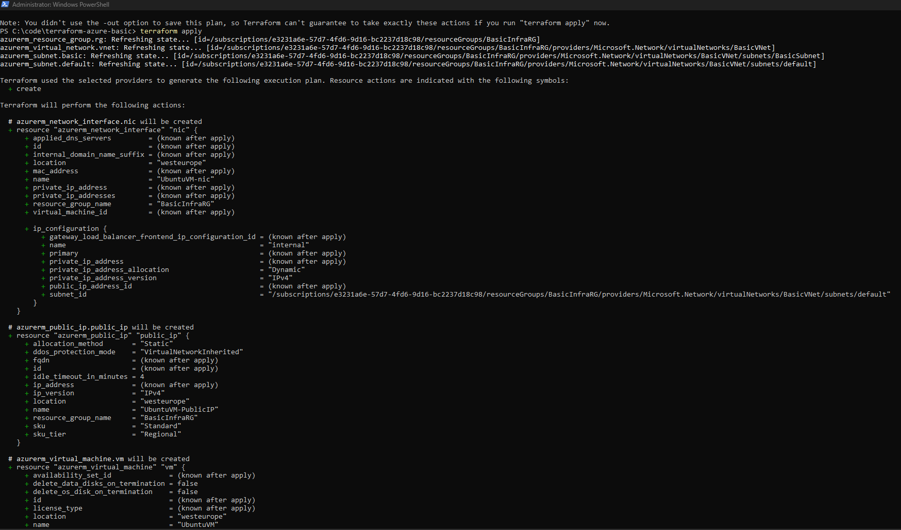
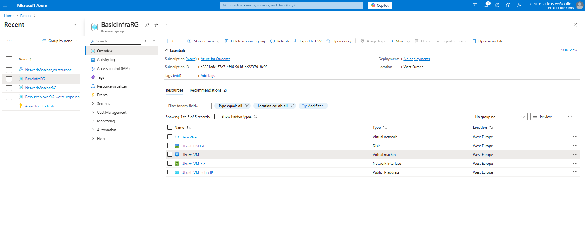
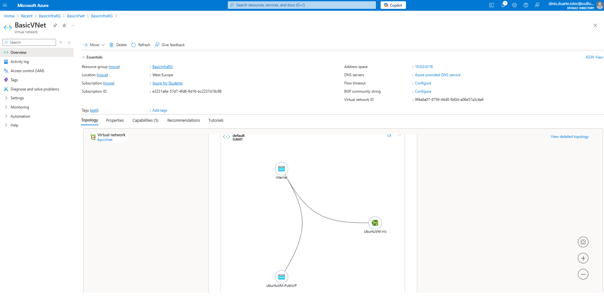

# Azure Basic Infrastructure with Terraform

This project demonstrates how to create a basic infrastructure in Azure using Terraform. It includes:
- **Resource Group**
- **Virtual Network (VNet)** with two subnets (`default` and `BasicSubnet`)
- **Ubuntu Virtual Machine (VM)** with a public IP address.

## Resources Created
- **Resource Group:** BasicInfraRG
- **Virtual Network:** BasicVNet (10.0.0.0/16)
  - **Subnets:**
    - `default` - 10.0.0.0/24
    - `BasicSubnet` - 10.0.1.0/24
- **Virtual Machine:** UbuntuVM
  - Operating System: Ubuntu Server 20.04
  - Size: Standard B1s (1 vCPU, 1GB RAM)
  - Public IP: Static, automatically assigned

---

## How to Use

### 1. Install Prerequisites
Make sure you have the following installed:
- **Terraform CLI:** [Install Guide](https://developer.hashicorp.com/terraform/tutorials/aws-get-started/install-cli)
- **Azure CLI:** [Install Guide](https://learn.microsoft.com/en-us/cli/azure/install-azure-cli)
- An active Azure subscription (e.g., Azure Students account).

### 2. Clone this repository
Run the following commands to clone and navigate to the project directory:

```bash
git clone https://github.com/dinAlexDu/azure-terraform-basic.git
cd azure-terraform-basic
```

### 3. Authenticate with Azure
Log in to your Azure account using Azure CLI:
```bash
az login
```
If the default az login doesn't work, try:
```bash
az login --use-device-code
```

### 4. Initialize Terraform
Run this command to initialize the Terraform working directory:
```bash
terraform init
```

### 5. Validate the Configuration
Verify that the configuration is valid:
```bash
terraform validate
```

### 6. Plan and Apply the Infrastructure
Generate an execution plan to preview the changes:
```bash
terraform plan
```
Deploy the infrastructure:
```bash
terraform apply
```

### 7. Connect to the Virtual Machine
Retrieve the public IP of the VM from the Terraform output or Azure Portal. Then, connect via SSH:
```bash
ssh azureuser@<PUBLIC_IP>
```
Replace <PUBLIC_IP> with the actual IP address.

## Screenshots

### Virtual Machine in Azure


### Terraform Output


### Resources in Azure Portal


### Virtual Network Configuration



## Cleaning Up
To avoid unnecessary costs, destroy the infrastructure when you're done:
```bash
terraform destroy
```

## Notes:
This project is intended for learning purposes. Adjustments can be made to customize the infrastructure for your needs.
