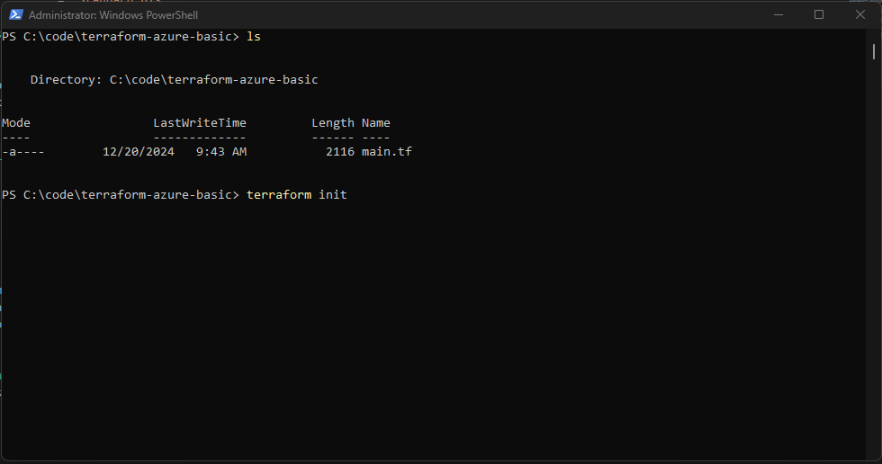

# Azure Basic Infrastructure with Terraform
---
**A Hands-on Lab for Deploying Basic Infrastructure in Azure using Terraform**
---

This project demonstrates how to create a basic infrastructure in Azure using Terraform. It includes deploying a Resource Group, a Virtual Network (VNet) with subnets, and an Ubuntu Virtual Machine (VM) with a public IP address.

---

## Table of Contents
1. [Project Objectives](#project-objectives)
2. [Steps Implemented](#steps-implemented)
3. [Screenshots](#screenshots)
4. [Tools Used](#tools-used)
5. [Useful Links](#useful-links)
6. [License](#license)
7. [Contributions](#contributions)

---

## Project Objectives

- **Create a Resource Group:**  
  Organize all related Azure resources in a single container.

- **Set up a Virtual Network (VNet):**  
  Configure address spaces and subnets for network management.

- **Deploy a Virtual Machine:**  
  Provision an Ubuntu VM with a public IP and SSH access.

- **Automate with Terraform:**  
  Utilize Terraform to manage and deploy the infrastructure.

---

## Steps Implemented

1. **Initialize Terraform Configuration**  
   - Used `main.tf` as the primary Terraform configuration file to define resources such as the Resource Group, VNet, Subnets, and VM.
   - Initialized Terraform in the project directory using:
     ```bash
     terraform init
     ```

2. **Validate Configuration**  
   - Validated the syntax and structure of `main.tf`:
     ```bash
     terraform validate
     ```

3. **Generate and Apply Terraform Plan**  
   - Previewed the changes Terraform would apply:
     ```bash
     terraform plan
     ```
   - Deployed the infrastructure using:
     ```bash
     terraform apply
     ```

4. **Resources Created**  
   - **Resource Group:** `BasicInfraRG`  
   - **Virtual Network:** `BasicVNet`  
     - **Address Space:** `10.0.0.0/16`  
     - **Subnets:**  
       - `default` - `10.0.0.0/24`  
       - `BasicSubnet` - `10.0.1.0/24`  
   - **Virtual Machine:** `UbuntuVM`  
     - **Operating System:** Ubuntu Server 20.04  
     - **Size:** Standard B1s (1 vCPU, 1GB RAM)  
     - **Public IP:** Static, automatically assigned  

5. **Connect to the Virtual Machine**  
   - Retrieved the VM's public IP from the Terraform output and established an SSH connection:
     ```bash
     ssh azureuser@<PUBLIC_IP>
     ```
     Replace `<PUBLIC_IP>` with the actual IP.

6. **Clean Up Resources**  
   - To avoid unnecessary costs, destroyed the resources using:
     ```bash
     terraform destroy
     ```

---


## Screenshots

Below are the screenshots that illustrate the steps:

1. **Resource Group Overview**  
     
   *List of resources created under the `BasicInfraRG` Resource Group.*

2. **Terraform Initialization**  
     
   *Terraform initialized successfully for the project directory.*

3. **Terraform Plan Output**  
     
   *Preview of the resources to be created, as defined in `main.tf`.*

4. **Virtual Network Overview**  
     
   *Visualization of the VNet topology and connected resources.*

---

## Tools Used

- **Terraform CLI:** For managing infrastructure as code.  
- **Azure CLI:** For authenticating with Azure.  
- **Visual Studio Code:** For editing `main.tf`.  
- **Azure Portal:** For resource management and validation.  


---

## Useful Links

- [Terraform Documentation](https://developer.hashicorp.com/terraform/docs)  
  Official documentation for Terraform configuration and management.

- [Azure Virtual Network Documentation](https://learn.microsoft.com/en-us/azure/virtual-network/)  
  Comprehensive guide to configuring VNets in Azure.

- [Azure Virtual Machine Documentation](https://learn.microsoft.com/en-us/azure/virtual-machines/)  
  Guide for deploying and managing Azure VMs.
---

## License

This project is licensed under the [MIT License](./LICENSE).  
See the LICENSE file for detailed terms and conditions.

---

## Contributions

Contributions are welcome!  
If you have suggestions for improvements or additional use cases, feel free to [fork this repository](https://github.com/dinAlexDu/azure-terraform-basic) and submit a pull request.  

Please adhere to our [Code of Conduct](./CODE_OF_CONDUCT.md) when contributing to this project.
